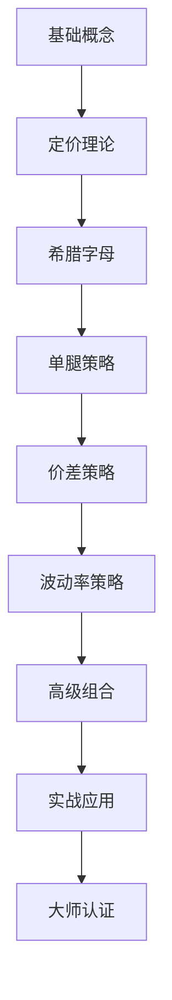

# 🎯 美股智投期权课程 | US Stock Options Trading Course

[](https://opensource.org/licenses/Apache-2.0)
[](https://github.com/opitios-ai/-)
[](https://github.com/opitios-ai/-)
[](https://github.com/opitios-ai/-)

> **专业的美国股票期权交易教育平台** | Professional US Stock Options Trading Education Platform

## 🌟 课程简介 | Course Overview

**美股智投期权课程**是一套完整的美国股票期权交易教育体系，从基础概念到高级策略，帮助投资者系统掌握期权交易技能。课程涵盖50个核心主题，适合不同水平的交易者学习。

**US Stock Options Trading Course** is a comprehensive educational system for American stock options trading, from basic concepts to advanced strategies, helping investors systematically master options trading skills. The course covers 50 core topics, suitable for traders of different levels.

### 🎯 目标受众 | Target Audience

- **初学者** | Beginners: 期权交易新手，希望建立扎实基础
- **中级交易者** | Intermediate Traders: 有一定经验，希望提升策略水平
- **高级投资者** | Advanced Investors: 专业交易者，寻求复杂策略和风险管理
- **金融从业者** | Financial Professionals: 需要期权知识的金融行业人员

## 📚 课程结构 | Course Structure

### 🏗️ 基础篇 (第1-10课) | Foundation (Lessons 1-10)
- **第1课**: 美股期权初探 | US Stock Options Introduction
- **第2课**: 看涨期权与看跌期权基础 | Call and Put Options Basics
- **第3课**: 期权市场结构 | Options Market Structure
- **第4课**: 期权合约要素详解 | Options Contract Elements
- **第5课**: 美式期权vs欧式期权 | American vs European Options
- **第6课**: 期权流动性分析 | Options Liquidity Analysis
- **第7课**: 期权价值构成 | Options Value Composition
- **第8课**: 期权状态分类 | Options Moneyness Classification
- **第9课**: 期权风险管理基础 | Options Risk Management Basics
- **第10课**: 期权交易平台与工具 | Options Trading Platform and Tools

### 🧮 理论篇 (第11-20课) | Theory (Lessons 11-20)
- **第11课**: Black-Scholes定价模型 | Black-Scholes Pricing Model
- **第12课**: 二叉树定价模型 | Binomial Pricing Model
- **第13课**: 期权定价影响因素 | Options Pricing Factors
- **第14课**: 隐含波动率分析 | Implied Volatility Analysis
- **第15课**: 期权定价偏差与套利 | Options Pricing Arbitrage
- **第16课**: Delta价格敏感性 | Delta Price Sensitivity
- **第17课**: Gamma Delta变化率 | Gamma Delta Change Rate
- **第18课**: Theta时间价值衰减 | Theta Time Decay
- **第19课**: Vega波动率风险 | Vega Volatility Risk
- **第20课**: Rho利率风险 | Rho Interest Rate Risk

### 📈 策略篇 (第21-35课) | Strategies (Lessons 21-35)
- **第21-25课**: 单腿策略 | Single-Leg Strategies
- **第26-30课**: 价差策略 | Spread Strategies
- **第31-35课**: 波动率策略 | Volatility Strategies

### 🚀 高级篇 (第36-50课) | Advanced (Lessons 36-50)
- **第36-40课**: 高级组合策略 | Advanced Portfolio Strategies
- **第41-45课**: 实战精进 | Practical Trading
- **第46-50课**: 大师认证 | Master Certification

## 🌍 地理位置优化 | Geographic Optimization

### 🇺🇸 美国市场 | US Markets
- **纽约证券交易所 (NYSE)** | New York Stock Exchange
- **纳斯达克 (NASDAQ)** | NASDAQ
- **芝加哥期权交易所 (CBOE)** | Chicago Board Options Exchange
- **美国期权交易所 (AMEX)** | American Stock Exchange

### 🇨🇳 中国市场 | Chinese Markets
- **上海证券交易所** | Shanghai Stock Exchange
- **深圳证券交易所** | Shenzhen Stock Exchange
- **中国金融期货交易所** | China Financial Futures Exchange

### 🌏 全球市场 | Global Markets
- **欧洲期权市场** | European Options Markets
- **亚洲期权市场** | Asian Options Markets
- **跨境投资策略** | Cross-border Investment Strategies

## 🔍 SEO优化关键词 | SEO Optimized Keywords

### 📊 核心关键词 | Core Keywords
- **美股期权** | US Stock Options
- **期权交易** | Options Trading
- **期权策略** | Options Strategies
- **期权定价** | Options Pricing
- **风险管理** | Risk Management
- **投资教育** | Investment Education

### 🎯 长尾关键词 | Long-tail Keywords
- **美股期权交易课程** | US Stock Options Trading Course
- **期权交易策略大全** | Complete Options Trading Strategies
- **期权风险管理技巧** | Options Risk Management Techniques
- **期权定价模型应用** | Options Pricing Model Applications
- **期权交易心理分析** | Options Trading Psychology Analysis

### 🏷️ 标签关键词 | Tag Keywords
- `#美股期权` `#期权交易` `#投资教育` `#风险管理` `#交易策略`
- `#USStockOptions` `#OptionsTrading` `#InvestmentEducation` `#RiskManagement` `#TradingStrategies`

## 🛠️ 技术特性 | Technical Features

### 📱 响应式设计 | Responsive Design
- **移动端优化** | Mobile Optimized
- **平板适配** | Tablet Compatible
- **桌面端支持** | Desktop Support

### 🎨 用户体验 | User Experience
- **直观导航** | Intuitive Navigation
- **交互式图表** | Interactive Charts
- **实时计算器** | Real-time Calculators
- **模拟交易** | Paper Trading

### 🔧 技术栈 | Technology Stack
- **HTML5** | Modern HTML5 Structure
- **CSS3** | Advanced CSS3 Styling
- **JavaScript** | Interactive JavaScript
- **Chart.js** | Professional Charting
- **响应式框架** | Responsive Framework

## 📖 使用方法 | How to Use

### 🚀 快速开始 | Quick Start

1. **克隆仓库** | Clone Repository
```bash
git clone https://github.com/opitios-ai/-.git
cd opitios-learn-option
```

2. **打开课程** | Open Course
```bash
# 打开主页面
open index.html

# 或直接访问特定课程
open lesson-01-us-stock-options-introduction.html
```

3. **开始学习** | Start Learning
- 按顺序学习基础课程
- 实践交易策略
- 参与模拟交易

### 📚 学习路径 | Learning Path



## 🎓 认证体系 | Certification System

### 🥉 初级认证 | Beginner Certification
- 完成第1-10课
- 通过基础测试
- 获得期权交易入门证书

### 🥈 中级认证 | Intermediate Certification
- 完成第11-25课
- 通过策略测试
- 获得期权策略分析师证书

### 🥇 高级认证 | Advanced Certification
- 完成第26-40课
- 通过高级测试
- 获得期权交易专家证书

### 🏆 大师认证 | Master Certification
- 完成第41-50课
- 通过综合评估
- 获得期权交易大师证书

## 📊 课程统计 | Course Statistics

- **总课程数** | Total Lessons: 50
- **总学习时长** | Total Learning Hours: 100+
- **练习题数量** | Practice Questions: 500+
- **实战案例** | Real Cases: 200+
- **更新频率** | Update Frequency: 每月 | Monthly

## 🤝 贡献指南 | Contributing

### 📝 如何贡献 | How to Contribute

1. **Fork 仓库** | Fork Repository
2. **创建分支** | Create Branch
3. **提交更改** | Commit Changes
4. **推送分支** | Push Branch
5. **创建 Pull Request** | Create Pull Request

### 🐛 报告问题 | Report Issues

- 使用 [Issues](https://github.com/opitios-ai/-/issues) 报告问题
- 提供详细的错误描述
- 包含复现步骤

### 💡 功能建议 | Feature Suggestions

- 使用 [Discussions](https://github.com/opitios-ai/-/discussions) 提出建议
- 描述功能需求
- 提供使用场景

## 📄 许可证 | License

本项目采用 [Apache-2.0](LICENSE) 许可证。

This project is licensed under the [Apache-2.0](LICENSE) License.

## 📞 联系我们 | Contact Us

### 🌐 官方网站 | Official Website
- **网站** | Website: [https://opitios.com](https://opitios.com)
- **邮箱** | Email: contact@opitios.com

### 📱 社交媒体 | Social Media
- **Twitter**: [@opitios_ai](https://twitter.com/opitios_ai)
- **LinkedIn**: [OPITIOS AI](https://linkedin.com/company/opitios-ai)
- **YouTube**: [OPITIOS期权课程](https://youtube.com/@opitios-ai)

### 💬 社区支持 | Community Support
- **GitHub Discussions**: [参与讨论](https://github.com/opitios-ai/-/discussions)
- **Discord**: [加入社区](https://discord.gg/WEcqGUPjAN)

## 🙏 致谢 | Acknowledgments

感谢所有为这个项目做出贡献的开发者和教育工作者。

Thanks to all developers and educators who contributed to this project.

### 🏆 特别感谢 | Special Thanks
- **期权交易专家** | Options Trading Experts
- **金融教育工作者** | Financial Educators
- **开源社区** | Open Source Community
- **测试用户** | Beta Testers

## 📈 项目状态 | Project Status


---

<div align="center">

**⭐ 如果这个项目对您有帮助，请给我们一个星标！** | **⭐ If this project helps you, please give us a star!**

[](https://star-history.com/#opitios-ai/-&Date)

</div>

---

*最后更新 | Last Updated: 2025年1月27日 | January 27, 2025*
